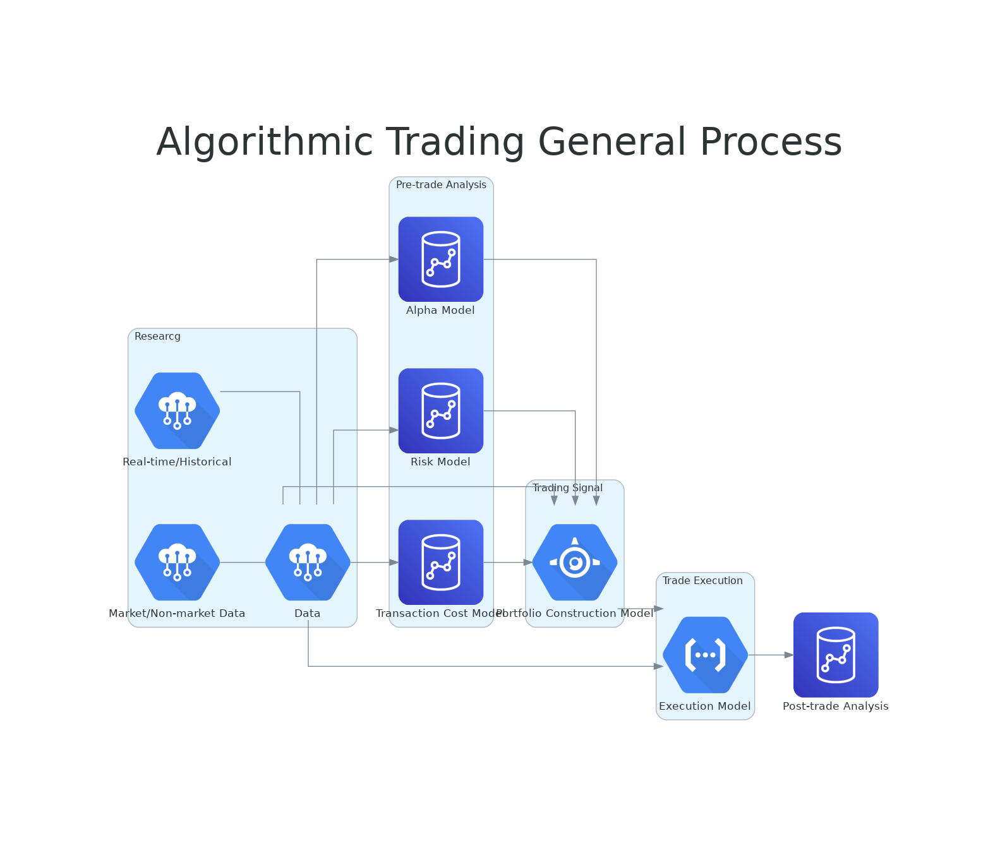

# Algorithmic Trading
Financial industry is evolving, with computers playing a bigger roles. Algorithmic, or computer-driver, trading now makes up the large majority of trades - more than 90% of orders by some metrics and estimates.

## General Process

## Basics
- Algo trading essentially comes in two flavors - market making and data mining
- Market-making trades attempt to capitalize on the bid-ask spread - typically associated with high-frequency traders
- Data-mining trades based on patterns in data, including stock prices and outside information
- We look for correlations between stock prices and other data points
- Algo Trading relies on programmable objective criteria.

### Market making
**Centralized Order Book: Orders, Stacks, and Matching**
**Order types**:
  - _Market order_ - immediately
  - _Limit order_ - specific price
  - _Iceberg order_ - large single order that has been divided into smaller lots

**Order conditions**:
  - _Time in force_
  - _Day order_ - valid only for less than a day
  - _Good till cancelled_ - valid until executed or cancelled
  - _Fill or kill_ - immediately execute or cancel

**Conditional Orders**:
  - _Stop order_ - to sell/buy when the price of a security falls/rises to a designated level
  - _Stop limit order_ - executed at the exact price or better

**Discretionary order**:
  - Traditional orders
  - Broker decides when and price

### An algorithm example
- Get Time, Price, Index
- Calculate **Natural Price**
$$ Natural\ Price = Last\ Price - Relative\ Index\ Change * Std.\ Dev.$$
- **Buy/No Buy**
  - if( Natural Price > Price ): _Buy_
  - else: _No Buy_

### Steps in Building an Algo
- Define trading hypothesis and goal
- Set operating time horizon and constraints
- Algo testing

**Maintaining an Algorithm**
- Continual monitoring and maintenance
  - Monitor performance
  - Monitor market conditions
- Maintenance and rejuvenation

**Algorithmic Trading Requirements**
- Centralize order book
- Access to the (highly liquid) markets
- Systems (three types):
  - In-house systems
  - Client systems
  - Vendor systems
- Information exchange

### An Algo Trading Example
- Renaissance Technologies is one of the most famous hedge funds pursuing algorithmic trading. RenTech gave an [example](www.bloomberg.com/news/articles/2016-11-21/how-renaissance-s-medallion-fund-became-finance-s-blackest-box) of the type of trade they pursue:
  - When skies are cloudy, equities markets tend to perform worse then when skies are clear
  - In theory, we can buy or sell based on data about weather forecasts then
  - Practically speaking it's hard to trade on weather patterns - they are imprecise and the correlations are low
  - Correlations between stock prices and weather are low
- Another [example](www.econ.yale.edy/~shiller/behfin/2006-04/cohen-frazzini.pdf) of algo trading is supplier/customer realtionships
  - When a samall firm reports earnings, it has implications for other large companies that are custormers or suppliers of that small company
  - Think Apple and some of the small vendors it uses

### Text and Data
Field known as Textual Analysis, Natural language processing, Sentiment analysis, content analysis, computational linguistics.

Pull qualitative information and transform into quantitative signals that can be used in a model

A dictionary/list of words and their associated content (positive, negative, etc.) is required for sentiment analysis in text.

Increased inerest attributable to:
  - Bigger, faster computers
  - Availability of large quantities of text
  - New technologies derived from search engines

Examples of data sources:
- EDGAR (1994-2011) - 22.7 million filings
- WSJ News Archive (2000 to present) - XML encapsulated
- Audio transcripts (such as conference calls) - [SeekingAlpha](Seekingalpha.com)
- Websites
- Google searchs
- Twitter/StockTwits

Textual Analysis Software
- Block boxes, such as WordStat, Lexalytics, Diction
- Two critical components:
  - Ability to download data and convert into string/character variable
  - Ability to parse large quantities of text
  - Most modern languages provide for both of these functions (Perl, Python, SAS Text Miner, VB.NET)

### Algo Trading as a Carrer
- What do algo traders do?
- What skills do they need?
- How does the job/team work?
- [LinkedIn](https://www.linkedin.com/jobs/search/?keywords=algorithmic%20trading&location=Worldwide)

Typical Job Description
- Design of frameworks and functionality for development of trading algos
- Implementation, testing, and production
- System tuning and optimization
- Calibration and optimization of parameters
- Proactive identification of problems and issues and resolution of them

## Algorithmic Trading with Python
- [Stock Trading with Python](https://github.com/FernandoMarcon/learning_notes/blob/main/finance/stock_trading_with_python.py)

## Algorithmic Trading with R
- [R and Bond Trading](https://github.com/FernandoMarcon/learning_notes/blob/main/finance/r_and_bond_trading.R)

## Sources:
- [Algorithmic Trading and Finance Models with Python, R, and Stata Essential Training (LinkedIn Course)](https://www.linkedin.com/learning/algorithmic-trading-and-finance-models-with-python-r-and-stata-essential-training/)
