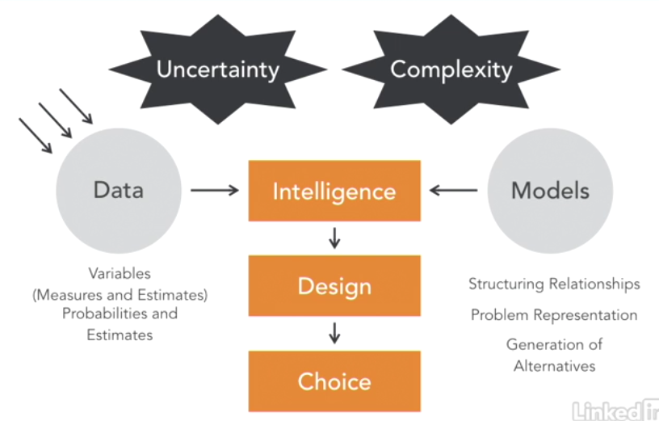

# Financial Forecasting with Big Data

## Business Intelligence (BI)
- Term coined in 1993
- Not just software
- BI statistical tools
- Takes you from raw data to business insight

### How BI Works
Combines data and models to help make choices.

### BI Advantages
- Avoid guessing
- Improve forecasting
- Ensure business continuity
- Reduce subjectivity

### BI Disadvantages
- Complexity
- Upfront investment - BI is a process!
- Analysis paralysis
- Risk of black boxes

## Conventional Finantial Forecasting
### The Percent of Sales Method
- This is the most common method
- It begins with the sales forecast at an annual growth rate in revenue
- Balance sheet and income statement change proportionally with sales
- Long-term forecasts are based on the compoound annual growth rate (CAGR)

### Income Statement Forecasts
- Income statement is generated by finding costs that change directly with sales
- Plowback: the percentage of net income is reinvested by the firm as retained earnings
- Income statement forecast determines the growth rate of future sales

### Balance Sheet Forecasts
- Balance sheet item - some vary with sales; some do not
- To determine variation with sales, review historial accounts
- Often varying directly with sales:
  - Working Capital Accounts
  - Inventory
  - A/R
  - A/P

## Source
- [ Financial Forecasting with Big Data ](https://www.linkedin.com/learning/financial-forecasting-with-big-data/basics-of-financial-regression-analysis)
-
